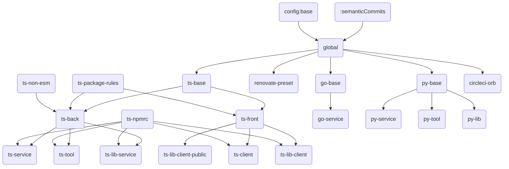

# Renovate dependencies

```mermaid
graph TD;
ts-npmrc("ts-npmrc") --> ts-service("ts-service")
ts-npmrc("ts-npmrc") --> ts-client("ts-client")
ts-npmrc("ts-npmrc") --> ts-tool("ts-tool")
ts-npmrc("ts-npmrc") --> ts-lib-client("ts-lib-client")
ts-npmrc("ts-npmrc") --> ts-lib-service("ts-lib-service")
ts-non-esm("ts-non-esm") --> ts-back("ts-back")
ts-package-rules("ts-package-rules") --> ts-back("ts-back")
ts-package-rules("ts-package-rules") --> ts-front("ts-front")
config:base("config:base") --> global("global")
:semanticCommits(":semanticCommits") --> global("global")
global("global") --> ts-base("ts-base")
global("global") --> renovate-preset("renovate-preset")
global("global") --> go-base("go-base")
global("global") --> py-base("py-base")
global("global") --> circleci-orb("circleci-orb")
ts-base("ts-base") --> ts-back("ts-back")
ts-base("ts-base") --> ts-front("ts-front")
go-base("go-base") --> go-service("go-service")
py-base("py-base") --> py-service("py-service")
py-base("py-base") --> py-tool("py-tool")
py-base("py-base") --> py-lib("py-lib")
ts-back("ts-back") --> ts-service("ts-service")
ts-back("ts-back") --> ts-tool("ts-tool")
ts-back("ts-back") --> ts-lib-service("ts-lib-service")
ts-front("ts-front") --> ts-lib-client-public("ts-lib-client-public")
ts-front("ts-front") --> ts-client("ts-client")
ts-front("ts-front") --> ts-lib-client("ts-lib-client")
```