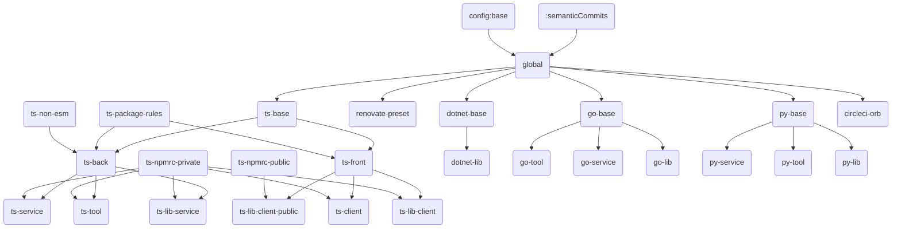

# Renovate dependencies

```mermaid
graph TD;
ts-npmrc-public("ts-npmrc-public") --> ts-lib-client-public("ts-lib-client-public")
ts-npmrc-private("ts-npmrc-private") --> ts-service("ts-service")
ts-npmrc-private("ts-npmrc-private") --> ts-client("ts-client")
ts-npmrc-private("ts-npmrc-private") --> ts-tool("ts-tool")
ts-npmrc-private("ts-npmrc-private") --> ts-lib-client("ts-lib-client")
ts-npmrc-private("ts-npmrc-private") --> ts-lib-service("ts-lib-service")
ts-non-esm("ts-non-esm") --> ts-back("ts-back")
ts-package-rules("ts-package-rules") --> ts-back("ts-back")
ts-package-rules("ts-package-rules") --> ts-front("ts-front")
config:base("config:base") --> global("global")
:semanticCommits(":semanticCommits") --> global("global")
global("global") --> ts-base("ts-base")
global("global") --> renovate-preset("renovate-preset")
global("global") --> go-base("go-base")
global("global") --> dotnet-base("dotnet-base")
global("global") --> py-base("py-base")
global("global") --> circleci-orb("circleci-orb")
dotnet-base("dotnet-base") --> dotnet-lib("dotnet-lib")
go-base("go-base") --> go-tool("go-tool")
go-base("go-base") --> go-service("go-service")
go-base("go-base") --> go-lib("go-lib")
ts-base("ts-base") --> ts-back("ts-back")
ts-base("ts-base") --> ts-front("ts-front")
py-base("py-base") --> py-service("py-service")
py-base("py-base") --> py-tool("py-tool")
py-base("py-base") --> py-lib("py-lib")
ts-back("ts-back") --> ts-service("ts-service")
ts-back("ts-back") --> ts-tool("ts-tool")
ts-back("ts-back") --> ts-lib-service("ts-lib-service")
ts-front("ts-front") --> ts-lib-client-public("ts-lib-client-public")
ts-front("ts-front") --> ts-client("ts-client")
ts-front("ts-front") --> ts-lib-client("ts-lib-client")
```